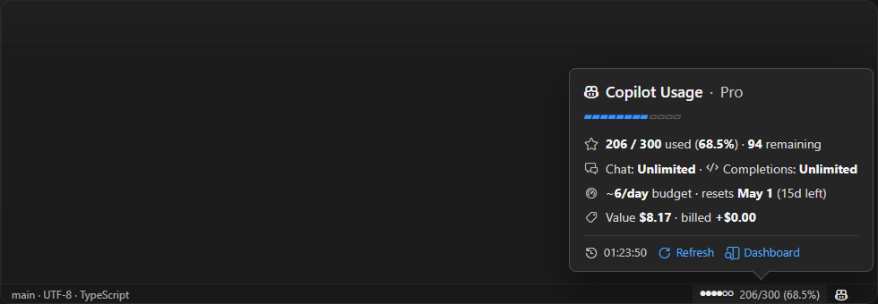

# Copilot Usage Insights

[](https://github.com/sin2akshay/copilot-usage-insights/releases) [](LICENSE) [](https://code.visualstudio.com/)

> VS Code Marketplace availability is in progress. Until then, install the extension from the GitHub Releases `.vsix` package.

See your GitHub Copilot premium request usage without leaving VS Code.

GitHub Copilot usage is built around [premium requests](https://docs.github.com/en/copilot/concepts/billing/copilot-requests), not a simple token balance shown in the editor. GitHub gives each plan a monthly premium request allowance, and premium models or features can deduct from that allowance using model-specific multipliers. This extension makes that request-based system easier to see and manage inside VS Code. For plan details, see [Plans for GitHub Copilot](https://docs.github.com/en/copilot/get-started/plans-for-github-copilot).

Copilot Usage Insights adds a compact status bar indicator, a readable hover summary, and a full dashboard so you can answer the questions that actually matter while you work:

- How much quota have I used?
- How many requests do I have left?
- Am I burning through usage too quickly?
- Am I already in paid overage?

It is designed to stay quiet on startup, use your existing GitHub sign-in when available, and show real numbers from GitHub instead of local guesses.

**Status bar widget and hover tooltip**



**Dashboard with quota, pacing, billing, and request breakdown**


## Why Install It

- Keep an eye on premium requests without opening GitHub or billing pages.
- Catch pacing issues early with remaining quota and requests-per-day guidance.
- See Chat, Completions, and Premium usage in one place.
- Optionally unlock billing and model-level breakdowns when you need deeper insight.
- Avoid noisy startup auth prompts: the extension stays idle until access is available or explicitly requested.

## Install

This extension is currently distributed through GitHub Releases as a `.vsix` package.

We are working on making it available on the VS Code Marketplace as well.

### Option 1: Download from Releases

1. Open the [Releases page](https://github.com/sin2akshay/copilot-usage-insights/releases).
2. Download the latest `.vsix` asset.
3. In VS Code, open the Extensions view.
4. Select the `...` menu in the top-right corner.
5. Choose **Install from VSIX...** and pick the downloaded file.

### Option 2: Install from the command line

```powershell
code --install-extension path\to\copilot-usage-insights-1.6.0.vsix
```

If the `code` command is not available in your shell, install from the VS Code Extensions view instead.

## Quick Start

1. Install the latest `.vsix` from the [Releases page](https://github.com/sin2akshay/copilot-usage-insights/releases).
2. Open VS Code and run **Copilot Usage Insights: Sign In** from the Command Palette.
3. Look at the status bar item next to the GitHub Copilot icon.
4. Hover for a quick summary, or click it to open the full dashboard.
5. If you want billing insight, enable **Billing Details** in the dashboard and grant the additional GitHub scope when prompted.

## What You Get

### In the status bar

- Live premium usage right next to the GitHub Copilot icon.
- Multiple text modes such as percent, used/quota, remaining, or billed-only.
- Optional compact graphics such as blocks, dots, circles, braille, and segmented bars.
- Warning and critical colors when your usage crosses configured thresholds.

### In the hover tooltip

- Your current plan and premium usage summary.
- Remaining quota and Chat/Completions status.
- A pacing hint such as how many requests per day you can spend until reset.
- Optional billing summary and top model usage when billing features are enabled.
- Quick actions to refresh or open the dashboard.

### In the dashboard

- An animated usage gauge for premium requests.
- Key stats for remaining requests, days until reset, and daily pacing.
- Separate quota cards for Chat, Completions, and Premium Interactions.
- Account details including plan type, Chat status, MCP status, and membership date.
- Optional billing summary, overage banner, and requests-by-model table.
- Inline settings so most display options can be changed without leaving the dashboard.

## How It Works

When you sign in, the extension calls GitHub's Copilot account endpoint, `copilot_internal/user`, to read your actual plan, quota, and usage.

That means:

- **No local estimation** of premium requests.
- **No org-level guesswork** for plan detection.
- **No prompt or editor content access**.
- **Real usage numbers from GitHub**.

If you enable billing features, the extension also calls GitHub's premium request billing usage endpoint. That requires the additional `user` scope so the extension can show gross value, billed overage, and request counts by model.

If no GitHub session is available at startup, the extension stays idle and waits for you to sign in. If the network is unavailable, it keeps the last known values visible and retries automatically.

## Status Bar Display

The status bar item appears immediately to the left of the GitHub Copilot icon. Two settings control the display: one for text and one for the graphic.

### Text (`statusBarTextMode`)

| Value | Example |
|---|---|
| `percent` *(default)* | `50%` |
| `count` | `150/300` |
| `countPercent` | `150/300 (50%)` |
| `remaining` | `150 left` |
| `billedOnly` | `+$0.00` |
| `none` | *(graphic only)* |

### Graphic (`statusBarGraphicMode`)

| Value | Example |
|---|---|
| `none` *(default)* | *(text only)* |
| `segmented` | `[■■■■□□□□]` |
| `blocks` | `████░░░░` |
| `thinBlocks` | `▰▰▰▰▱▱▱▱` |
| `dots` | `••••····` |
| `circles` | `●●●●○○○○` |
| `braille` | `⣿⣿⣿⣿⣀⣀⣀⣀` |
| `rectangles` | `▮▮▮▮▯▯▯▯` |

You can combine any text mode with any graphic mode. `statusBarTextPosition` controls whether the text appears on the left or right.

| Text | Graphic | Position | Result |
|---|---|---|---|
| `percent` | `blocks` | `left` | `50% ████░░░░` |
| `percent` | `blocks` | `right` | `████░░░░ 50%` |
| `countPercent` | `segmented` | `left` | `150/300 (50%) [■■■■□□□□]` |
| `countPercent` | `circles` | `right` | `●●●●○○ 206/300 (68.5%)` |
| `remaining` | `none` | - | `94 left` |
| `none` | `circles` | - | `●●●●○○○○` |
| `billedOnly` | `none` | - | `+$0.00` |

> `statusBarTextMode` and `statusBarGraphicMode` cannot both be `none`. If that happens, the extension falls back to `percent`.

When billing details are enabled and available, `showCostInStatusBar` appends the billed amount to non-`billedOnly` text modes, for example `●●●●○○ 206/300 (68.5%) · $0.00`.

## Commands

| Command | Description |
|---|---|
| `Copilot Usage Insights: Sign In` | Sign in with GitHub |
| `Copilot Usage Insights: Refresh` | Refresh usage data now |
| `Copilot Usage Insights: Open Details` | Open the dashboard |
| `Copilot Usage Insights: Disconnect Account` | Disconnect and clear the session |
| `Copilot Usage Insights: Open Settings` | Open extension settings |

## Settings

| Setting | Default | Description |
|---|---|---|
| `refreshIntervalMinutes` | `5` | How often to refresh usage data (1-60 min) |
| `threshold.enabled` | `true` | Enable color-coded threshold warnings |
| `threshold.warning` | `80` | Warning color threshold (%) |
| `threshold.critical` | `90` | Critical/error color threshold (%) |
| `statusBarTextMode` | `percent` | Text portion of the status bar: `none`, `count`, `percent`, `countPercent`, `remaining`, `billedOnly` |
| `statusBarGraphicMode` | `none` | Graphic portion of the status bar: `none`, `segmented`, `blocks`, `thinBlocks`, `dots`, `circles`, `braille`, `rectangles` |
| `statusBarTextPosition` | `left` | Whether text appears `left` or `right` of the graphic |
| `segmentedBarWidth` | `8` | Number of segments in bar-style graphic modes (4-16) |
| `showBillingDetails` | `false` | Enable billing summary and overage details; requests the additional GitHub `user` scope when needed |
| `showBillingRequestBreakdown` | `true` | Show the Requests by Model table when billing-powered request data exists, even if billed overage is still `$0.00` |
| `showCostInStatusBar` | `false` | Append the billed/net amount, for example `· $1.20`, when billing data is available |

Most settings can also be changed directly from the dashboard.

## Releases

Releases are published as versioned `.vsix` files on GitHub.

- Every tag matching `v*` triggers the release workflow.
- The workflow installs dependencies, runs type-checks, runs tests, packages the extension, and uploads the `.vsix` to the GitHub Release.
- GitHub also generates release notes automatically.

For end users, the simplest path is: open the [latest release](https://github.com/sin2akshay/copilot-usage-insights/releases/latest), download the `.vsix`, and install it in VS Code.

To see what changed, check [CHANGELOG.md](CHANGELOG.md).

## Privacy

The extension stores only your GitHub login name and two small preference flags in VS Code global state:

- whether you explicitly disconnected the extension
- whether the optional billing scope has already been granted or declined

GitHub access tokens are managed by VS Code's built-in authentication provider and are not stored by this extension.

The extension does not read or store your prompts, responses, files, or editor contents. Usage data comes from GitHub APIs.

## Development

```bash
npm install
npm run build
npm test
npm run check
```

Launch the extension in an Extension Development Host from VS Code after building.

## Build a VSIX

```bash
npm run package:vsix
```

This creates a `.vsix` package in the repository root that you can install through **Extensions: Install from VSIX...**.

//TODO
Apparently only Individual users on a paid Copilot plan can view their own usage and entitlements. For Copilot Business or Copilot Enterprise plans, organization admins and billing managers can view usage reports for members.

1. For Business and Enterprise plan users, disable the whole billing section by default

Instead of these options, display a elegant short info message that - Billing and requests by model options disabled for Copilot Business or Copilot Enterprise plans. Only organization admins and billing managers can view usage reports for members. 

Also, the View on Github link on the dashboard should take the users to the link https://github.com/settings/copilot/features as business/enterprise plan users can not have access to the link which we have now - https://github.com/settings/billing/premium_requests_usage

This also means Business/Enterprise copilot users can directly use the github account logged into vscode and will never need to be asked to login to github separately.

Think about how we will show overage for these users or might have to disable this option:


2. Turn the Show Requests by model toggle to off by default. I am assuming because of this, it is asking for login twice after install.

3. Turn the warning default to 75% which we changed to 80% earlier