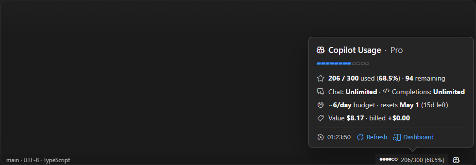
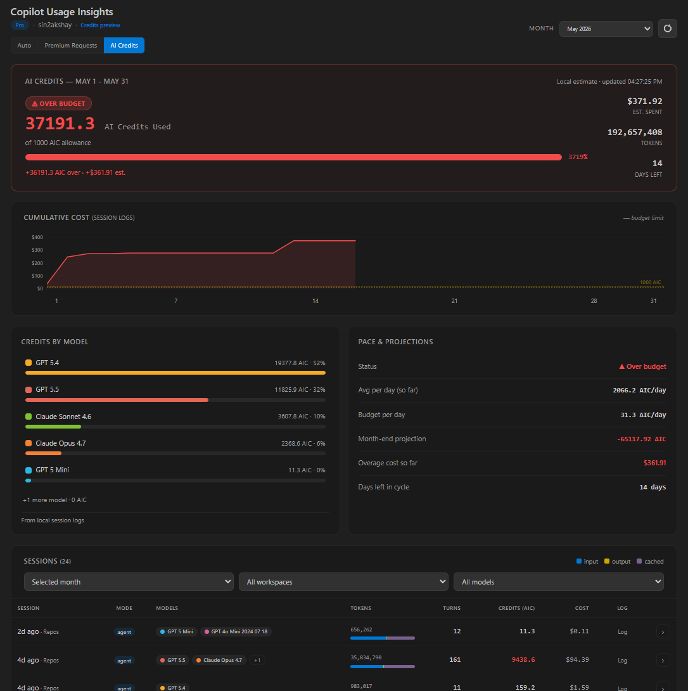
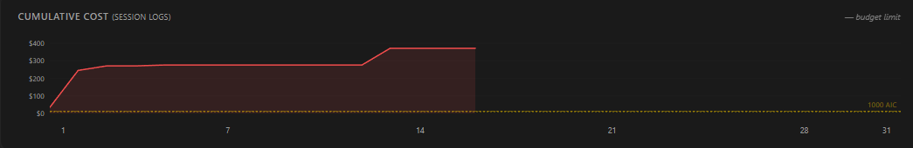
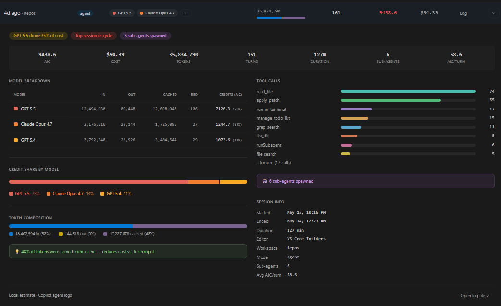
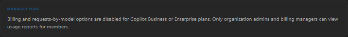

# Copilot Usage Insights

[](https://github.com/sin2akshay/copilot-usage-insights/releases) [](LICENSE) [](https://code.visualstudio.com/)

> VS Code Marketplace availability is in progress. Until then, install the extension from the GitHub Releases `.vsix` package.

Track your GitHub Copilot usage without leaving VS Code — quota, pacing, billing, and session-level AI Credits detail all in one place.

GitHub Copilot plans give you a monthly allowance of premium requests (or AI Credits from June 2026). This extension surfaces that allowance, how fast you are spending it, and whether you are at risk of overage, directly in the status bar, hover tooltip, and a full dashboard.



## What You Get

### Status bar

A compact indicator lives next to the GitHub Copilot icon at all times. It updates every 5 minutes (configurable) and supports multiple display modes:

- **Text modes** — percent used, used/quota count, remaining, or billed-only overage amount
- **Graphic modes** — segmented bar, blocks, thin blocks, dots, circles, braille, or rectangles
- **Color coding** — turns warning/critical color when usage crosses your configured thresholds

Hover the status bar item for an instant summary without opening the dashboard.

### Dashboard

Open the full dashboard from the status bar or via **Copilot Usage Insights: Open Details** in the Command Palette. The dashboard has two modes that switch automatically based on your plan, or you can pin either one in settings.

---

#### Premium Requests dashboard


For plans billed on the Premium Requests model (current default for individual, Business, and Enterprise plans):

- **Usage gauge** — animated circular gauge showing premium requests used vs allowance
- **Key stats** — remaining requests, days until quota reset, and requests-per-day budget
- **Quota cards** — separate cards for Chat, Completions, and Premium Interactions
- **Account info** — plan type, Chat status, MCP status, and membership date
- **Billing details** *(optional, requires additional GitHub scope)* — gross cost, billed/net overage, and a per-model request breakdown table
- **Pacing guidance** — how many requests per day you can spend and still finish the cycle on budget

---

#### AI Credits dashboard

For plans on the AI Credits billing model (rolling out June 2026). The extension automatically switches to this view when the GitHub billing API returns token-based usage data, or you can force it in settings.



**Status hero** — top of the dashboard shows your budget status at a glance:

- Over-budget / projected over / on-track badge
- Credits used and dollars spent this cycle
- Total tokens consumed and days remaining
- Month picker to review previous billing cycles

**Cumulative Cost chart** — a smooth line chart of estimated dollar cost day-by-day through the month. The filled area turns red once cumulative spend crosses your allowance. A dashed yellow line marks the budget limit; the Y-axis shows dollar amounts at human-friendly intervals.



**Credits by Model** — horizontal bar rows showing your top 5 models by AIC spend, each with name, value, and percentage. An overflow row summarises any additional models below the top 5.

**Pace & Projections** — six rows showing:

| Row | What it means |
|---|---|
| Status | On track / Projected over / Over budget |
| Avg per day (so far) | `creditsUsed ÷ daysElapsed` in AIC/day |
| Budget per day | `allowance ÷ daysInCycle` in AIC/day |
| Month-end projection | `allowance − projected` — negative means you will exceed budget |
| Overage cost so far | Dollars already spent above the allowance |
| Days left in cycle | Calendar days until quota resets |

**Session table** — a log of individual Copilot agent sessions pulled from local debug logs. Click any row to expand the full detail panel.



Each expanded session shows:

- **Model breakdown** — per-model token counts (input / output / cached), request count, and AIC credits
- **Credit share by model** — proportional stacked bar visualising each model's share of the session cost
- **Token composition** — stacked bar and legend for input, output, and cached tokens with percentages
- **Cache insight** — callout when ≥ 48 % of tokens were served from cache, with estimated dollar savings
- **Tool calls** — horizontal bar chart of the top 8 tools by call count, each bar in a distinct color
- **Session info** — started, ended, duration, editor, workspace, mode, sub-agent count, and average AIC per turn

---

### How session data is collected

The session table reads metadata from VS Code Copilot agent debug logs on your local machine. The log parser strips all prompt text, response text, tool arguments, tool results, and file contents before building session records. Only timestamps, model IDs, token counts, tool names, workspace folder name, and mode are retained. No session data is sent anywhere.

Enable debug logging with **Enable agent debug logging** in the dashboard, or by setting `github.copilot.advanced.debug.useNodeDebugger` in VS Code settings. The extension scans both Stable and Insiders workspace storage by default.

### Cost calculation

Token costs are calculated from the debug log fields `attrs.inputTokens`, `attrs.cachedTokens`, and `attrs.outputTokens` that the Copilot extension records for each model call. `inputTokens` is the total prompt size including the cached portion; `cachedTokens` is the subset served from cache. The extension charges:

- `(inputTokens − cachedTokens)` at the model's standard input rate
- `cachedTokens` at the model's cheaper cached rate (typically 10% of the input rate)
- `outputTokens` at the model's output rate

Rates are stored in a bundled `pricing.json` derived from [GitHub's published AI Credits pricing](https://docs.github.com/en/copilot/reference/copilot-billing/models-and-pricing). Use the **pricing.overrides** setting to adjust rates for any model without waiting for an extension update.

If session cost data looks wrong after a pricing change, use the **Rebuild** button in the AI Credits Settings section to wipe the local cache and re-parse all log files from scratch.

### Known limitation — cross-month sessions

Sessions are attributed to the month of their **last message**. A session started on April 29 with a final reply on May 2 appears entirely in May; April shows none of its cost. This means months with long-running cross-boundary sessions may look slightly cheaper or more expensive than the true spend for that calendar month.

## Install

This extension is distributed through GitHub Releases as a `.vsix` package.

### Option 1: Download from Releases

1. Open the [Releases page](https://github.com/sin2akshay/copilot-usage-insights/releases).
2. Download the latest `.vsix` asset.
3. In VS Code, open the Extensions view (`Ctrl+Shift+X`).
4. Select the `···` menu in the top-right corner.
5. Choose **Install from VSIX...** and pick the downloaded file.

### Option 2: Install from the command line

```powershell
code --install-extension path\to\copilot-usage-insights-1.8.2.vsix
```

## Quick Start

1. Install the latest `.vsix` from the [Releases page](https://github.com/sin2akshay/copilot-usage-insights/releases).
2. If the status bar item shows **Sign in**, run **Copilot Usage Insights: Sign In** from the Command Palette.
3. VS Code may reuse an existing GitHub session or ask you to authorize this extension.
4. The status bar item shows your current usage. Hover for a summary, click to open the dashboard.
5. To see billing detail (Premium Requests mode), enable **Billing Details** in the dashboard settings and grant the additional GitHub scope when prompted.
6. To see session-level detail (AI Credits mode), enable **Local log tracking** in the dashboard settings.

## Billing Modes

The `billingView` setting controls which dashboard is shown:

| Value | Behaviour |
|---|---|
| `auto` *(default)* | Shows AI Credits if the GitHub billing API returns token-based data; otherwise Premium Requests |
| `premium-requests` | Always show the Premium Requests dashboard |
| `ai-credits` | Always show the AI Credits dashboard |

Use **Copilot Usage Insights: Toggle Billing View** from the Command Palette to cycle between modes, or change the setting directly in the dashboard.

## Status Bar Display

Two settings control the status bar appearance.

### Premium Requests — `statusBarTextMode`

| Value | Example |
|---|---|
| `percent` *(default)* | `50%` |
| `count` | `150/300` |
| `countPercent` | `150/300 (50%)` |
| `remaining` | `150 left` |
| `billedOnly` | `+$0.00` |
| `none` | *(graphic only)* |

### AI Credits — `statusBar.creditsFormat`

| Value | Example |
|---|---|
| `used-over-allowance` *(default)* | `277.5 / 1000` |
| `percent` | `28%` |
| `dollars` | `$2.78` |
| `credits` | `277.5 AIC` |

### Graphic — `statusBarGraphicMode`

| Value | Example |
|---|---|
| `none` *(default)* | *(text only)* |
| `segmented` | `[■■■■□□□□]` |
| `blocks` | `████░░░░` |
| `thinBlocks` | `▰▰▰▰▱▱▱▱` |
| `dots` | `••••····` |
| `circles` | `●●●●○○○○` |
| `braille` | `⣿⣿⣿⣿⣀⣀⣀⣀` |
| `rectangles` | `▮▮▮▮▯▯▯▯` |

Combine any text mode with any graphic mode. `statusBarTextPosition` controls whether text appears left or right of the graphic.

> `statusBarTextMode` and `statusBarGraphicMode` cannot both be `none`. The extension falls back to `percent` if that happens.

## Commands

| Command | Description |
|---|---|
| `Copilot Usage Insights: Sign In` | Sign in with GitHub or authorize the existing VS Code GitHub session |
| `Copilot Usage Insights: Refresh` | Refresh usage data now |
| `Copilot Usage Insights: Open Details` | Open the dashboard |
| `Copilot Usage Insights: Disconnect Account` | Disconnect and clear the session |
| `Copilot Usage Insights: Toggle Billing View` | Cycle between Premium Requests and AI Credits views |
| `Copilot Usage Insights: Open Settings` | Open extension settings |

## Settings

| Setting | Default | Description |
|---|---|---|
| `refreshIntervalMinutes` | `5` | How often to refresh usage data (1–60 min) |
| `billingView` | `auto` | Dashboard mode: `auto`, `premium-requests`, or `ai-credits` |
| `threshold.enabled` | `true` | Enable color-coded threshold warnings |
| `threshold.warning` | `75` | Warning color threshold (%) |
| `threshold.critical` | `90` | Critical/error color threshold (%) |
| `statusBarTextMode` | `percent` | Premium Requests status bar text: `none`, `count`, `percent`, `countPercent`, `remaining`, `billedOnly` |
| `statusBarGraphicMode` | `none` | Status bar graphic: `none`, `segmented`, `blocks`, `thinBlocks`, `dots`, `circles`, `braille`, `rectangles` |
| `statusBarTextPosition` | `left` | Whether text appears `left` or `right` of the graphic |
| `statusBar.creditsFormat` | `used-over-allowance` | AI Credits status bar format: `percent`, `used-over-allowance`, `dollars`, `credits` |
| `segmentedBarWidth` | `8` | Segments in bar-style graphic modes (4–16) |
| `showBillingDetails` | `false` | Show billing summary and overage; requires the additional GitHub `user` scope |
| `showBillingRequestBreakdown` | `false` | Show the Requests by Model table even when billed overage is `$0.00` |
| `showCostInStatusBar` | `false` | Append billed amount (e.g. `· $1.20`) to the status bar when billing data is available |
| `localLogs.enabled` | `true` | Read local Copilot agent debug logs for session-level AI Credits estimates |
| `localLogs.includeInsiders` | `true` | Also scan VS Code Insiders workspace storage |
| `localLogs.lookbackDays` | `60` | How many days of session history to show in the AI Credits session table |
| `pricing.overrides` | `{}` | Per-model AIC rate overrides (credits per million tokens); supports `inputPerM`, `outputPerM`, `cachedPerM`, `cacheWritePerM` |

Most settings can be changed directly from the dashboard without opening VS Code settings.

## Managed Plan Limitation

For Copilot Business and Copilot Enterprise, GitHub does not expose member-level billing data through the endpoints this extension can access. The extension still shows your quota, remaining requests, and pacing, but:

- **Billing Details** and **Requests by Model** are disabled — those reports are reserved for org admins.
- The `billedOnly` status bar mode shows an estimate using GitHub's `$0.04/request` rate instead of your exact billed total.



For exact billed totals on managed plans, use your organisation's GitHub billing or usage reports.

## Privacy

The extension stores only your GitHub login name and two preference flags in VS Code global state: whether you explicitly disconnected the extension, and whether the optional billing scope has been granted.

GitHub access tokens are managed by VS Code's built-in authentication provider and are never stored by this extension.

The extension does not read or store prompts, responses, files, or editor contents. Usage data comes from GitHub APIs and local log metadata only.

Local session tracking reads only metadata: timestamps, model IDs, token counts, tool names, workspace folder name, and mode. All prompt text, response text, tool arguments, tool results, and file contents are stripped by the log parser before any data reaches the dashboard. No session data is sent to any telemetry endpoint or third-party service.

## How It Works

When you sign in, the extension calls GitHub's Copilot account endpoint to read your actual plan, quota, and usage — no local estimation or guesswork.

For **Premium Requests**, billing detail requires the additional `user` OAuth scope (requested only when you enable the feature).

For **AI Credits**, the extension calls `/users/{user}/settings/billing/usage` for the official monthly aggregate. If your account has not yet migrated to the AI Credits billing model, the dashboard falls back to local session estimates derived from Copilot agent debug logs.

If no GitHub session is available at startup, the extension stays idle and waits for you to sign in. If the network is unavailable, it keeps the last known values and retries automatically.

## Releases

Releases are published as versioned `.vsix` files on GitHub. Every tag matching `v*` triggers the release workflow, which runs type-checks, tests, and packages the extension before uploading the `.vsix` to the GitHub Release.

- [Latest release](https://github.com/sin2akshay/copilot-usage-insights/releases/latest)
- [Changelog](CHANGELOG.md)

## Development

```bash
npm install
npm run build
npm test
npm run check
```

Launch the extension in an Extension Development Host from VS Code (`F5`) after building.

## Build a VSIX

```bash
npm run package:vsix
```

This creates a `.vsix` in the repository root. Install it via **Extensions: Install from VSIX...** in VS Code.
